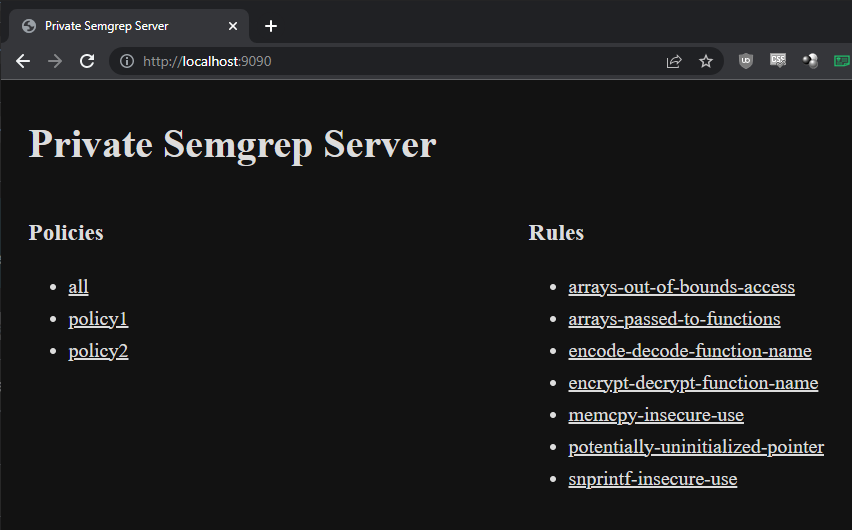

# Personal Semgrep Server
I created this personal [Semgrep][sem-url] server to learn Rust. It is suitable
for local deployment for folks who cannot use the[Semgrep SaaS App][sem-app]
because of custom Semgrep rules and proprietary code.

1. Unlimited local policies: A policy is a collection of rules.
2. Serve rules and policies over HTTP to the Semgrep CLI app.

[sem-url]: https://semgrep.dev/

It was inspired by [wahyuhadi/semgrep-server-rules][go-server].

[go-server]: https://github.com/wahyuhadi/semgrep-server-rules

I will try to keep the `main` branch usable. The `dev` branch is used for
development.

## Quickstart

```bash
$ cargo build
$ ./target/debug/personal-semgrep-server -r tests/rules/ -p tests/policies/
# run all rules against your code
$ semgrep --config http://localhost:9090/c/p/all path/to/code
```

**Note: Passing a policy path with "-p" is optional.** The only mandatory option
is `-r` that points to the location of the rules. In this case, it will only
serve individual rules or the `all` policy/rule.

## How to Use
Run the server and navigate to http://localhost:9090. The index has a link to
every rule and policy indexed by the server. This server uses the same path
structure as the Semgrep App.

* Policy URL: `/c/p/{policyid}`
* Rule URL: `/c/r/{ruleid}`

Pass these URLs directly to the Semgrep CLI app.



## Policies
Policies are collections of rules. A local policy is a YAML file like this:

```yaml
name: policy-name # this should be unique
rules:
- ruleID-1
- ruleID-2
- arrays-out-of-bounds-access
- potentially-uninitialized-pointer
- snprintf-insecure-use
```

Create as many as you want. After passing the path to the server, it will search
for all `.yaml` and `.yml` files in that path recursively. This allows you to
store your policies in subdirectories for better organization:

```
tests
└── policies
     ├── cpp
     |   ├── cpp-policy1.yaml
     |   └── cpp-policy2.yaml
     └── rust
         ├── rust-policy1.yaml
         └── rust-policy2.yaml
```

**Note: Policy names must be unique.** If you have duplicate policy names, one
will be overwritten by another.

### The 'all' Policy and Rule
The [semgrep-rs][semgrep-rs] library creates a built-in policy and rule named
`all`, even if you do not pass a policy path. The `all` rule/policy contains
every rule indexed by the server. It's useful when you want to run all rules
against a code base.
**If you have a custom rule or policy named `all`, it will be overwritten.**

[semgrep-rs]: https://github.com/parsiya/semgrep-rs

The Semgrep CLI app only runs specific rules against a file based on its
extension so don't shy from throwing the kitchen sink at your code with `all`.
See [Language extensions and tags][sem-ext] in the Semgrep documentation.

[sem-ext]: https://semgrep.dev/docs/writing-rules/rule-syntax/#language-extensions-and-tags

## Complete Rule IDs
**Similar to policy names, rule IDs must also be unique.** The
[Semgrep SaaS App][sem-app] uses complete rule IDs that are based on the path
to avoid this. For example, the complete rule ID for a rule with `id: double-free`
in the `rules/c/lang/security/double-free.c` file is:
`rules.c.lang.security.double-free.double-free`.

To create a complete rule ID, replace the path separator (`/`) with `.`, then
append the rule's internal ID (the value of the `id` key in the rule file).

My underlying library [semgrep-rs][complete-id] supports creating complete rule
IDs, but I have not added it to the current iteration of server because:

1. You have to include the complete rule ID in the policy file.
2. The rule ID will be dependent on the path passed to the server.

I can change this if we can come up with a solution to get consistent the rule
IDs.

[complete-id]: https://github.com/parsiya/semgrep-rs#complete-rule-ids

## Security
lol wut?! This is a geared Only run it on `localhost`.

## Why not Use the Semgrep App?
The [Semgrep SaaS App][sem-app] is awesome and you should use (and buy it) if
you can. But our custom rules and code had to stay local so I had to create a
directory structure for rules to simulate policies.

[sem-app]: https://semgrep.dev/products/semgrep-app

For example, to run all C++ rules against a target, your only realistic
option is to store all rules in a directory named `cpp` and pass it to config
with `--config path/to/cpp/`.

If you want to run a specific set of rules, then you can either copy/paste them
somewhere else or use the `--exclude-rule` command line option a bajillion
times. Custom rules are usually stored in a git repository so keeping multiple
copies updated is a tedious task.

Another issue is the directory structure of the
[Semgrep Registry on GitHub][sem-rules-gh]. It doesn't work for me. With local
policies, you can keep an updated clone of the registry along side your custom
rules and use any combination of them.

[sem-rules-gh]: https://github.com/returntocorp/semgrep-rules

## Features
I like to keep this server as simple as possible. I don't want to create a
Semgrep App competitor. The only thing I would add is a simple UI similar
to the [Semgrep Playground][sem-play] to allow people to run it locally for
proprietary rules/code.

[sem-play]: https://semgrep.dev/playground/
